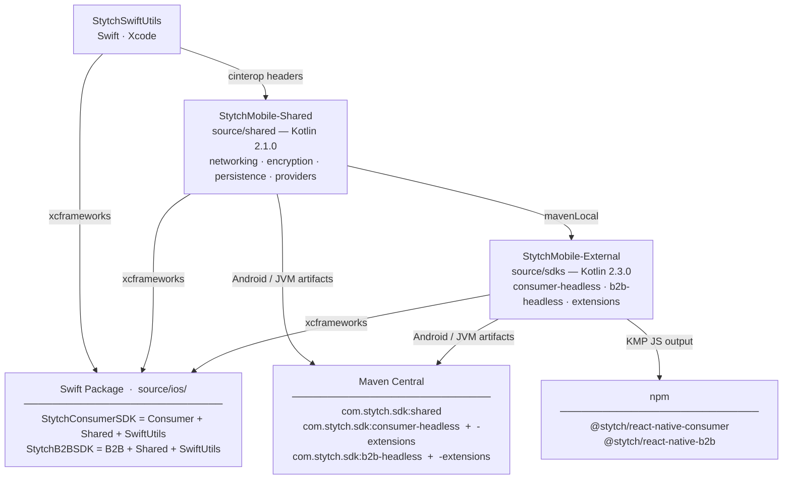

# Stytch Mobile SDKs

This monorepo contains the Stytch mobile SDKs for Android, iOS, React Native, and (to a limited extent) Desktop JVM, covering both Consumer and B2B authentication use cases. All SDKs share a common Kotlin Multiplatform (KMP) core.

## SDKs

| SDK | Android / JVM | iOS | React Native |
|-----|---------------|-----|--------------|
| Consumer | `com.stytch.sdk:consumer-headless` | `StytchConsumerSDK` (via SPM) | `@stytch/react-native-consumer` |
| Consumer (callback extensions) | `com.stytch.sdk:consumer-headless-extensions` | — | — |
| B2B | `com.stytch.sdk:b2b-headless` | `StytchB2BSDK` (via SPM) | `@stytch/react-native-b2b` |
| B2B (callback extensions) | `com.stytch.sdk:b2b-headless-extensions` | — | — |

---

## Repository Layout

```
build                          # Top-level build script (see below)
source/
  ios/                           # Swift Package for iOS distribution
    Package.swift                  # SPM package wrapping all xcframeworks
    *.xcframework                  # Built artifacts (not checked in, generated by ./build)
  shared/                      # Shared SDK — Kotlin 2.1.0 (Gradle: StytchMobile-Shared)
    sdk/shared/                  # Platform abstractions: networking, encryption,
                                 # persistence, biometrics/passkeys/OAuth, DFP/CAPTCHA
  sdks/                        # Consumer + B2B SDKs — Kotlin 2.3.0 (Gradle: StytchMobile-External)
    sdk/consumer-headless/       # Consumer auth SDK (all auth modules)
    sdk/b2b-headless/            # B2B auth SDK
    sdk/consumer-headless-extensions/  # Callback-style extensions for consumer SDK (Android + JVM)
    sdk/b2b-headless-extensions/       # Callback-style extensions for B2B SDK (Android + JVM)
  react-native/
    shared/                    # Shared RN native bridge code (iOS ObjC + Android Kotlin)
    consumer/                  # @stytch/react-native-consumer npm package
    b2b/                       # @stytch/react-native-b2b npm package
  StytchSwiftUtils/            # Swift-only utilities (CryptoKit bridge) compiled to xcframework
examples/
  android/                     # Android demo app
  ios/                         # iOS demo app (Xcode)
  rn/                          # React Native demo app (Expo)
  jvm/                         # JVM demo
```

---

## Architecture Overview



The three source projects have a strict build order: `StytchSwiftUtils` must be built first (its C interop headers are consumed by `StytchMobile-Shared`), then `StytchMobile-Shared` is published to mavenLocal before `StytchMobile-External` can compile. The `./build` script handles this automatically.

---

## Building

> **Xcode required.** Building any iOS artifact (including the `StytchSwiftUtils` framework that the shared SDK depends on) requires Xcode. There is no way to build the iOS targets without it. Android-only and JVM-only workflows still require a macOS machine with Xcode installed, because the Kotlin Multiplatform toolchain compiles iOS targets even when building non-iOS artifacts.

```bash
./build <tool> [sdk] [platform]
```

| Argument | Values |
|----------|--------|
| `tool` | `lint`, `test`, `bundle` |
| `sdk` | `consumer`, `b2b`, `shared`, or omit for all — `bundle` only |
| `platform` | `android`, `ios`, `rn`, or omit for all — `bundle` only |

**Examples:**

```bash
./build lint                      # Run ktlintCheck across all modules
./build test                      # Run jvmTest across all modules
./build bundle                    # Build everything (shared + consumer + B2B, all platforms)
./build bundle shared             # Build shared SDK only (no consumer/B2B artifacts)
./build bundle consumer           # Consumer SDK, all platforms
./build bundle b2b                # B2B SDK, all platforms
./build bundle consumer ios       # Consumer iOS xcframework only
./build bundle b2b android        # B2B Android artifact only
./build bundle consumer rn        # Consumer RN package (also updates the RN demo app)
```

**Build order** (handled automatically by the script):

1. Build `StytchSwiftUtils.xcframework` (Swift, Xcode) and copy it to `source/ios/` and the shared SDK's cinterop directory
2. Build and publish `source/shared` to mavenLocal (Kotlin 2.1.0)
3. Build the requested consumer/B2B artifacts from `source/sdks` (Kotlin 2.3.0)
4. Copy xcframeworks to `source/ios/`

After building, run the relevant app in `examples/` to test manually.

---

## Two-Project Architecture

The source is split across two separate Gradle projects. This is a deliberate compatibility tradeoff:

| Project | Location | Kotlin | Purpose |
|---------|----------|--------|---------|
| `StytchMobile-Shared` | `source/shared/` | **2.1.0** | Platform abstractions (networking, encryption, persistence, providers). Must stay on 2.1.0 for React Native compatibility. |
| `StytchMobile-External` | `source/sdks/` | **2.3.0** | Consumer and B2B auth SDKs. Requires 2.3.0 to export `suspend` functions to JavaScript. |

Why the split? React Native's Kotlin constraint is ≤ 2.1.0, but exporting `suspend` functions to JS requires ≥ 2.3.0. The shared SDK (platform-specific code) must be compatible with RN's native module build, while the consumer/B2B SDKs compile to JS where the suspend export is needed.

`source/sdks` depends on `source/shared` via mavenLocal — always build shared first (the `./build` script does this automatically).

---

## iOS Distribution

`source/ios/Package.swift` is a Swift Package that wraps four xcframeworks as binary targets:

- `StytchConsumerSDK.xcframework` — Consumer auth SDK
- `StytchB2BSDK.xcframework` — B2B auth SDK
- `StytchSharedSDK.xcframework` — Shared platform abstractions
- `StytchSwiftUtils.xcframework` — Swift utility bridge (CryptoKit, etc.)

**SPM products:**
- `StytchConsumerSDK` — depends on Consumer + Shared + SwiftUtils frameworks
- `StytchB2BSDK` — depends on B2B + Shared + SwiftUtils frameworks

**Minimum iOS deployment target:** 15.0

The xcframeworks are not checked into the repo. Run `./build` to generate them before opening the iOS Swift Package or the Xcode demo project.

---

## React Native Architecture

The RN packages (`@stytch/react-native-consumer` and `@stytch/react-native-b2b`) use React Native's New Architecture (TurboModules).

**Data flow:**

```
React component
  → imports from @stytch/react-native-consumer (or b2b)
  → calls KMP-compiled JS code (lib/consumer-headless.mjs / lib/b2b-headless.mjs)
  → KMP JS actual classes call methods on a global StytchBridge JS object
  → StytchBridge is the TurboModule (NativeStytchBridge.ts spec)
  → native bridge to StytchBridge.mm (iOS, ObjC) or StytchBridgeModule.kt (Android)
  → calls into StytchSharedSDK xcframework (iOS) or mavenLocal artifact (Android)
```

Complex types are JSON-encoded across the bridge. The native bridge code is shared between the React Native B2B and Consumer clients, and lives in a `shared/` folder.

> **Important:** The native bridge files (`android/`, `ios/`, `src/NativeStytchBridge.ts`) are **not checked into the consumer or b2b packages** — they are generated from `source/react-native/shared/` at build time. Running `yarn build` (which internally runs `yarn setup`) copies them into place before compiling. Always run `yarn build` (or `./build consumer rn` / `./build b2b rn` from the repo root) before attempting to open or build the React Native example apps. After a fresh checkout or after modifying the shared bridge, re-run `yarn build` in the affected package.

**RN peer dependency:** `react-native >= 0.80.x`

**Building the RN packages:**

```bash
./build consumer rn   # Builds KMP JS, copies to react-native/consumer/lib, runs yarn build, updates RN demo
./build b2b rn        # Same for B2B
```

---

## Running Tests

Tests live in `jvmTest` source sets in both Gradle projects. The easiest way to run them all:

```bash
./build test
```

Or run individual modules directly:

```bash
# Consumer SDK tests
cd source/sdks
./gradlew :sdk:consumer-headless:jvmTest

# Consumer callback extensions tests
./gradlew :sdk:consumer-headless-extensions:jvmTest

# B2B SDK tests
./gradlew :sdk:b2b-headless:jvmTest

# B2B callback extensions tests
./gradlew :sdk:b2b-headless-extensions:jvmTest

# Shared SDK tests
cd source/shared
./gradlew :sdk:shared:jvmTest
```

Test framework: `kotlin.test` + MockK + `kotlinx-coroutines-test`.

---

## SDK Module Reference

### Consumer SDK (`source/sdks/sdk/consumer-headless/`)

| Module | Description |
|--------|-------------|
| `otp` | One-time passcodes (SMS, email, WhatsApp) |
| `magicLinks` | Email magic links |
| `passwords` | Password auth + strength checks |
| `oauth` | OAuth (Google, Apple, etc.) |
| `passkeys` | WebAuthn/passkeys |
| `biometrics` | Biometric authentication |
| `totp` | Time-based one-time passwords |
| `session` | Session management |
| `user` | User profile management |
| `crypto` | Crypto wallet authentication |
| `dfp` | Device fingerprinting |

### B2B SDK (`source/sdks/sdk/b2b-headless/`)

| Module | Description |
|--------|-------------|
| `otp` | One-time passcodes |
| `magicLinks` | Email magic links |
| `passwords` | Password auth |
| `oauth` | OAuth + Discovery |
| `sso` | SAML/OIDC SSO |
| `totp` | TOTP |
| `session` | Session management |
| `members` | Member management |
| `organizations` | Organization management |
| `discovery` | Cross-org discovery flow |
| `rbac` | Role-based access control |
| `scim` | SCIM provisioning |
| `recoveryCodes` | Recovery code management |
| `dfp` | Device fingerprinting |

### Callback Extensions (`source/sdks/sdk/*-headless-extensions/`)

Optional add-on modules for Android and JVM that provide callback-style overloads for every suspend function in the Consumer and B2B SDKs. Each overload takes `onSuccess` and `onFailure` lambdas and returns a `Job`:

```kotlin
// Instead of:
val result = stytch.session.revoke()

// You can use:
val job = stytch.session.revoke(
    onSuccess = { response -> /* handle success */ },
    onFailure = { error -> /* handle failure */ },
)
```

The callback extensions are generated at build time by a KSP processor that reads `@StytchApi`-annotated interfaces in the base modules. These modules re-export (`api(...)`) the base headless module, so adding the extensions dependency replaces the base dependency.

**Targets:** Android and JVM only — not necessary or available for iOS or React Native.

| Artifact | Extends |
|----------|---------|
| `com.stytch.sdk:consumer-headless-extensions` | `com.stytch.sdk:consumer-headless` |
| `com.stytch.sdk:b2b-headless-extensions` | `com.stytch.sdk:b2b-headless` |

---

### Shared SDK (`source/shared/sdk/shared/`)

Platform abstractions consumed by both consumer and B2B SDKs:
- Networking (HTTP client, bootstrap API)
- Encryption (`StytchEncryptionClient`)
- Persistence (`StytchPersistenceClient`)
- Providers: `BiometricsProvider`, `PasskeyProvider`, `OAuthProvider`
- PKCE, DFP, CAPTCHA

---

## Key Notes

**`StytchSwiftUtils`** bridges Swift-only APIs (CryptoKit) to Kotlin/Native via C interop. `StytchEncryptionClient` on iOS calls into this framework. The header files (`StytchSwiftUtils-device.h`, `StytchSwiftUtils-simulator.h`) are generated during the build and committed to `source/shared/sdk/shared/src/iosMain/interop/`.

**Hybrid interface pattern for testability:** `expect class` types cannot be subclassed, so `I`-prefixed interfaces (`IBiometricsProvider`, `IPasskeyProvider`, `IOAuthProvider`) are defined in `commonMain`. Consumer and B2B clients depend on these interfaces rather than the concrete `expect class` types, enabling MockK-based unit testing.

**Code generation:** The OpenAPI spec at `source/sdks/sdk/resources/openapi.yml` drives Ktorfit HTTP interface + model generation. The `@NetworkModel` KSP annotation generates public DTO classes. Do not edit the spec or generated files by hand.

**Callback extensions generation:** The `@StytchApi` annotation (defined in `source/shared`) marks client interfaces whose suspend functions should get callback overloads. A KSP processor (`StytchCallbackProcessor`) runs during the `consumer-headless` and `b2b-headless` builds and writes the generated `*Callbacks.kt` files to `build/generated/callbacks/commonMain/kotlin/`. The `*-extensions` modules then compile those files as their sole source. Do not edit the generated files by hand — modify the processor in `source/sdks/buildSrc/` instead.

---

## CI / Release Workflows

### Workflow Overview

| Workflow | File | Trigger |
|----------|------|---------|
| Quality Control | `qc.yml` | Every PR; `workflow_dispatch` |
| Cut Release | `release.yml` | `workflow_dispatch` |
| Tag on Release | `tag-on-release.yml` | `release/*` PR merged to `main` |
| Publish | `publish.yml` | Tag push (`1.2.3`); `workflow_dispatch` |
| Docs | `docs.yml` | After Publish succeeds; `workflow_dispatch` |
| Build Shared (reusable) | `_build-shared.yml` | Called by Publish and Docs |

---

### Quality Control (`qc.yml`)

Runs on every pull request and can be triggered manually. Cancels in-progress runs for the same ref.

| Job | Runner | What it does |
|-----|--------|--------------|
| `check-shared` | ubuntu | `ktlintCheck detekt koverXmlReportJvm` on `source/shared`; posts coverage comment on PRs |
| `check-sdks` | macos | Publishes shared to mavenLocal, then `ktlintCheck detekt checkLegacyAbi koverXmlReportJvm` on `source/sdks`; posts coverage comment |
| `check-ios-simulator` | macos | Builds a simulator-only SwiftUtils framework, runs `iosSimulatorArm64Test` on `source/shared` |
| `check-android-instrumented` | ubuntu | Runs `connectedAndroidTest` on `source/shared` in an Android emulator (API 29) |
| `check-swift-utils` | macos | `xcodebuild test` on `StytchSwiftUtils.xcodeproj`; uploads `.xcresult` coverage bundle |
| `check-rn` | ubuntu | `yarn test` for both `react-native/consumer` and `react-native/b2b` |

The `check-sdks` job also runs `checkLegacyAbi` — a binary-compatibility check that fails if a public API change is made without updating the `.api` golden files. Update those files with `./gradlew updateLegacyAbi` when an intentional API change is made.

---

### Release Process

Releasing follows a three-step automated process. The version to release is always read from `version.txt` at the repo root (no `v` prefix, e.g. `1.2.3`).

#### Step 1 — Cut the release (`release.yml`, `workflow_dispatch`)

1. Reads `version.txt` and validates that no tag with that version exists yet.
2. Installs [git-cliff](https://git-cliff.org) and generates a changelog entry for all unreleased commits since the last tag, prepending it to `CHANGELOG.md`. Configuration lives in `cliff.toml` at the repo root.
3. **Dry run** (default): uploads `CHANGELOG.md` and the entry snippet as an artifact for preview — nothing is pushed or opened.
4. **Real run**: creates a `release/{version}` branch, commits the changelog update, pushes the branch, and opens a PR titled `chore: release {version}`. The PR body includes the generated changelog entry.

Before running for real, bump `version.txt` and commit it to `main`. Review the changelog in dry-run mode first if you want to check the output.

#### Step 2 — Merge the PR (`tag-on-release.yml`)

Fires when any `release/*` PR is **merged** (not just closed) into `main`.

1. Validates that `RELEASE_PAT` is configured (see [Required Secrets](#required-secrets)).
2. Checks that the branch version (`release/1.2.3` → `1.2.3`) still matches `version.txt` and that no tag exists yet.
3. Pushes the version tag using `RELEASE_PAT`. Using the PAT (rather than the default `GITHUB_TOKEN`) is required so that the tag push triggers `publish.yml` — GitHub does not allow `GITHUB_TOKEN`-triggered events to start downstream workflows.

#### Step 3 — Publish (`publish.yml`)

Triggered automatically by a tag push matching `[0-9]*.[0-9]*.[0-9]*`, or manually via `workflow_dispatch` (dry run defaults to `true` for safety).

```
build-shared  (reusable: _build-shared.yml)
    │
    ├── publish-kmp       — Maven Central (shared + consumer + b2b + extensions)
    ├── publish-ios       — stytchauth/stytch-ios SPM repo + xcframework zips
    └── publish-rn        — npm (@stytch/react-native-consumer, @stytch/react-native-b2b)
          │
          └── create-github-release  — GH release with install coordinates + changelog entry
```

**`build-shared` (reusable workflow `_build-shared.yml`):** Builds `StytchSwiftUtils.xcframework`, verifies the C interop headers are unchanged (fails fast if they need updating), builds `StytchSharedSDK.xcframework`, and uploads both as workflow artifacts for the downstream jobs.

**`publish-kmp`:** Downloads the SwiftUtils interop and shared xcframework artifacts (needed to compile iOS targets), publishes shared to mavenLocal, then publishes all five Maven artifacts to Maven Central (`shared`, `consumer-headless`, `b2b-headless`, `consumer-headless-extensions`, `b2b-headless-extensions`).

**`publish-ios`:** Downloads artifacts, builds consumer and B2B xcframeworks, zips all four frameworks, computes SHA-256 checksums, substitutes URLs and checksums into `source/ios/Package.swift.template` to produce `source/ios/Package.swift`. On a real run, clones `stytchauth/stytch-ios`, commits `Package.swift` + `Sources`, pushes + tags, and creates a GitHub release there with the four xcframework zips attached.

**`publish-rn`:** Downloads artifacts, publishes shared to mavenLocal, builds KMP JS output for consumer and B2B, stamps the version into `package.json` files, runs `yarn build`, packs both packages. On a real run, publishes both to npm. Always uploads `.tgz` packs as artifacts.

**`create-github-release`:** Runs after all three publish jobs succeed. Extracts the current version's section from `CHANGELOG.md`, prepends an "Install" block with Maven/npm/SPM coordinates, and creates a GitHub release on this repo.

---

### Docs (`docs.yml`)

Triggered automatically after `publish.yml` completes successfully, or manually via `workflow_dispatch`.

```
build-shared  (reusable: _build-shared.yml)
    │
    ├── generate-android-docs  — Dokka HTML (source/sdks → build/dokka/html/)
    └── generate-ios-docs      — DocC static sites (consumer + B2B)
          │
          └── deploy-pages  — assembles pages/ directory and deploys to GitHub Pages
```

**Android docs:** Runs `dokkaGenerateHtml` in `source/sdks`, producing a multi-module Dokka site covering consumer, B2B, and the extensions modules.

**iOS docs:** Builds consumer and B2B xcframeworks, extracts symbol graphs with `swift-symbolgraph-extract`, injects KDoc comments from the Kotlin-generated ObjC headers into the symbol graphs via `scripts/inject-docs.py`, then renders static DocC sites with `xcrun docc convert`.

**Deploy:** Downloads both doc artifacts, copies the landing page from `docs/index.html`, and deploys to GitHub Pages at the repo's Pages URL.

---

### Changelog (`cliff.toml`)

`CHANGELOG.md` is maintained by [git-cliff](https://git-cliff.org), configured in `cliff.toml`. Only conventional commit types that are user-facing appear in the changelog:

| Prefix | Section |
|--------|---------|
| `feat:` | Features |
| `fix:` | Bug Fixes |
| `docs:` | Documentation |
| `perf:` | Performance |
| `refactor:` | Refactoring |
| Everything else (`chore:`, `ci:`, `build:`, `test:`, merge commits, non-conventional) | Skipped |

The catch-all skip rule forces good commit naming — if a commit should appear in the changelog, it must use one of the prefixes above.

---

### Required Secrets

| Secret | Used by | Purpose |
|--------|---------|---------|
| `APPLE_CERTIFICATE_BASE64` | `_build-shared.yml`, `publish-ios`, `check-swift-utils` | Code-signing certificate (base64 DER) |
| `APPLE_CERTIFICATE_PASSWORD` | same | Certificate passphrase |
| `KEYCHAIN_PASSWORD` | same | Temporary keychain password |
| `MAVEN_CENTRAL_USERNAME` | `publish-kmp` | Sonatype Central Portal username |
| `MAVEN_CENTRAL_PASSWORD` | `publish-kmp` | Sonatype Central Portal password |
| `SIGNING_KEY` | `publish-kmp` | GPG key for Maven artifact signing (in-memory, ASCII armored) |
| `SIGNING_KEY_ID` | `publish-kmp` | GPG key ID |
| `SIGNING_KEY_PASSWORD` | `publish-kmp` | GPG key passphrase |
| `SPM_REPO_TOKEN` | `publish-ios` | PAT with write access to `stytchauth/stytch-ios` |
| `RELEASE_PAT` | `tag-on-release.yml` | PAT with `contents: write`; required to trigger downstream workflows from a tag push |
